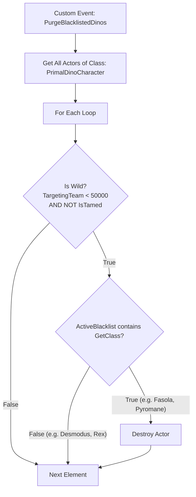

# ARK: Survival Ascended (ASA) Purist Mod - Blueprint Assembly Guide

This guide provides the exact pin-by-pin instructions for creating the **ASE Purist Mod** inside the **ARK: Survival Ascended DevKit**. Keep this open while working in the DevKit.

---

## Part 1: Mod Structure Setup

Every ARK mod requires three fundamental files: a **PrimalGameData**, a **GameMode**, and an **Entry Level**.

1. **Create Mod Folder:**
   - In the Content Browser, navigate to `Content/Mods/`.
   - Right-click and create a new folder named `ASEPurist`.
2. **Create `PrimalGameData_BP_ASEPurist`:**
   - In your `ASEPurist` folder, right-click &rarr; **Blueprint Class**.
   - In the search box, search for `PrimalGameData_BP`.
   - Select it as the parent class and name the asset: `PrimalGameData_BP_ASEPurist`.
   - Open it, set `Mod Name` in the Details panel to **ASE Purist**, then Compile & Save.
3. **Create `TestGameMode_ASEPurist`:**
   - In your `ASEPurist` folder, right-click &rarr; **Blueprint Class**.
   - Search for `TestGameMode`.
   - Select it as the parent class and name the asset: `TestGameMode_ASEPurist`.
   - Open it, go to the Details panel:
     - Find **Default Primal Game Data**.
     - Set it to: `PrimalGameData_BP_ASEPurist`.
   - Compile & Save.
4. **Create `ASEPurist_EntryLevel`:**
   - Right-click &rarr; **Level** (or File &rarr; New Level &rarr; Empty Level).
   - Name it: `ASEPurist_EntryLevel`.
   - Open the level. In the top menu, open **Window &rarr; World Settings**.
   - In World Settings, find **GameMode Override**.
   - Select: `TestGameMode_ASEPurist`.
   - Save the level.

---

## Part 2: Creating the Spawn Interceptor Actor

This invisible actor runs silently on the server/host, parses the `.ini` settings on startup, and sweeps away any blacklisted wild creatures.

1. In `Content/Mods/ASEPurist/`, right-click &rarr; **Blueprint Class** &rarr; select **Actor**.
2. Name it: `BP_ASE_SpawnInterceptor`.
3. Open `BP_ASE_SpawnInterceptor`.

### Variables to Create (Left Panel):

| Variable Name | Variable Type | Is Array? | Description |
| :--- | :--- | :--- | :--- |
| `ActiveBlacklist` | Class Reference &rarr; `PrimalDinoCharacter` | **Yes** (Array) | Holds the active list of blocked creature classes. |
| `TimerHandle_Purge` | `Timer Handle` | No | Tracks the repeating 1.5s purge loop. |

---

## Part 3: Blueprint Event Graph Logic

Open the **Event Graph** of `BP_ASE_SpawnInterceptor`.

### 1. Server Authority Check
All creature destruction and INI reading **must** run on the server/host:
* From **`Event BeginPlay`**, connect to a **`Switch Has Authority`** node.
* Leave the **Remote** pin disconnected (clients do nothing).
* Drag from the **Authority** pin to proceed to initialization.

### 2. Reading INI Options & Building the Blacklist
From the **Authority** pin, cast to the GameMode to access ARK's INI helper:
1. Add node: **`Get Game Mode`** &rarr; connect to **`Cast To ShooterGameMode`**.
2. Promote the `As Shooter Game Mode` output pin to a local variable or wire directly.
3. For each creature, we check if the user enabled it. If **NOT** enabled (`False`), we add its class to `ActiveBlacklist`.

#### Example Pattern for Each Creature:
```text
[Cast To ShooterGameMode]
       │
       ▼
[Get Bool Option Ini] 
    ├── Target: ShooterGameMode
    ├── Section: "ASEPurist"
    ├── Option: "AllowPyromane"
    └── Default: False
       │
       ▼ (Return Value)
    [Branch]
       ├── True:  (Do nothing; player wants Pyromanes!)
       └── False: [Add (ActiveBlacklist)] ──> Class: Pyromane_Character_BP_C
```

#### Repeating for Categories / Creatures:
Repeat this simple check (or create a small Blueprint Macro) for the following classes (refer to `creature_reference.md`):
* `Fasola_Character_BP_C` (Option: `"AllowFasolasuchus"`)
* `Oasisaur_Character_BP_C` (Option: `"AllowOasisaur"`)
* `Pyromane_Character_BP_C` (Option: `"AllowPyromane"`)
* `Gigantoraptor_Character_BP_C` (Option: `"AllowGigantoraptor"`)
* `Shastasaurus_Character_BP_C` (Option: `"AllowShastasaurus"`)
* `YiLing_Character_BP_C` (Option: `"AllowYiLing"`)
* `Cosmo_Character_BP_C` (Option: `"AllowCosmo"`)
* `Sir5rM8_Character_BP_C` (Option: `"AllowSir5rM8"`)
* `Dreadmare_Character_BP_C` (Option: `"AllowDreadmare"`)
* `Dreadnoughtus_Character_BP_C` (Option: `"AllowDreadnoughtus"`)
* `Armadoggo_Character_BP_C` (Option: `"AllowArmadoggo"`)

**For Garuga Additions:**
First check: `GetBoolOptionIni("ASEPurist", "AllowAllGarugaAdditions")`.
* If `False`, check individual toggles:
  * `Ceratosaurus_Character_BP_C` (Option: `"AllowCeratosaurus"`)
  * `Deinosuchus_Character_BP_C` (Option: `"AllowDeinosuchus"`)
  * `Archelon_Character_BP_C` (Option: `"AllowArchelon"`)
  * `Brachiosaurus_Character_BP_C` (Option: `"AllowBrachiosaurus"`)
  * `Xiphactinus_Character_BP_C` (Option: `"AllowXiphactinus"`)
  * `Helicoprion_Character_BP_C` (Option: `"AllowHelicoprion"`)

#### Future-Proofing with CustomBlockedDinos:
To make sure you never have to recook the mod when Wildcard adds future dinos:
1. Add node: **`Get String Option Ini`** &rarr; Section: `"ASEPurist"`, Option: `"CustomBlockedDinos"`.
2. Connect output to **`Parse Into Array`** (Delimiter: `","`).
3. Connect output to a **`For Each Loop`**:
   - Store these string names into a string array variable: `CustomBlockedNames` (Array of Strings).
   - In the purge check, we can check both class references and string names (`Get Class` -> `Get Display Name` -> `Contains`)!

---

### 3. Setting Up the Purge Loop
Once the INI checks finish and `ActiveBlacklist` is populated:
1. Connect the last node to **`Set Timer by Event`**.
   - **Time:** `1.5` seconds.
   - **Looping:** `True` (Checked).
2. Create a **Custom Event** named `PurgeBlacklistedDinos`.
3. Connect the red square event delegate from `PurgeBlacklistedDinos` to the **Event** pin of `Set Timer by Event`.

---

### 4. The Purge Execution Graph (`PurgeBlacklistedDinos`)

When the timer fires every 1.5 seconds:
1. From `PurgeBlacklistedDinos`, call **`Get All Actors of Class`**.
   - **Actor Class:** `PrimalDinoCharacter`.
2. Connect `Out Actors` to a **`For Each Loop`**.
3. Inside the loop (`Loop Body`):
   - Cast or wire the `Array Element` to `PrimalDinoCharacter`.
   - **CRITICAL SAFETY CHECK (Never destroy tamed dinos!):**
     - Pull from the dino &rarr; search for **`Targeting Team`** (Integer).
     - Pull from `Targeting Team` &rarr; **`Less Than (<)`** &rarr; enter `50000`.
     - *(In ARK, wild dinos have targeting teams below 50,000; tamed dinos and player-owned creatures are 50,000+).*
     - Also verify **`Is Tamed`** is `False`.
   - Feed the result into a **`Branch`**.
   - From the **True** pin (Dino is wild):
     - Pull from the dino &rarr; **`Get Class`**.
     - Pull from `ActiveBlacklist` &rarr; **`Contains Item`** &rarr; pass the Dino Class.
     - Feed into another **`Branch`**.
     - From **True** (Dino is on the blacklist):
       - Call **`Destroy Actor`** targeting the Dino!



Compile and Save `BP_ASE_SpawnInterceptor`!

---

## Part 4: Placing the Interceptor in the Entry Level

1. Open `ASEPurist_EntryLevel`.
2. Drag `BP_ASE_SpawnInterceptor` from your Content Browser into the level viewport (coordinates at `0, 0, 0`).
3. Save the level.

---

## Part 5: In-Editor Testing & Verification

1. In the DevKit toolbar, click **Play &rarr; Selected Viewport / Standalone**.
2. Open the in-game console by pressing `Tab` or `~`.
3. Force a repopulation of the map:
   ```text
   admincheat DestroyWildDinos
   ```
4. Attempt to spawn a blacklisted creature manually as a wild test:
   ```text
   admincheat SpawnDino "Blueprint'/Game/ScorchedEarth/Dinos/Fasolasuchus/Fasola_Character_BP.Fasola_Character_BP'" 500 0 0 150
   ```
   *Result:* The creature will be destroyed by the interceptor within 1.5 seconds!
5. Now test an ASE creature (like Desmodus):
   ```text
   admincheat SpawnDino "Blueprint'/Game/Fjordur/Dinos/Desmodus/Desmodus_Character_BP.Desmodus_Character_BP'" 500 0 0 150
   ```
   *Result:* The Desmodus flies happily and stays completely untouched!

---

## Part 6: Cooking and Uploading to CurseForge

1. In the DevKit top toolbar, locate the **CurseForge / Mod Tools** button.
2. Click **Cook & Package Mod**:
   - Primary Game Data: `PrimalGameData_BP_ASEPurist`
   - Mod Title: **ASE Purist (Classic Creature Spawns)**
   - Description: Copy from `README.md`
3. Check target platforms:
   - [x] **Windows (PC)**
   - [x] **Xbox Series X/S**
   - [x] **PlayStation 5**
4. Click **Upload**!
